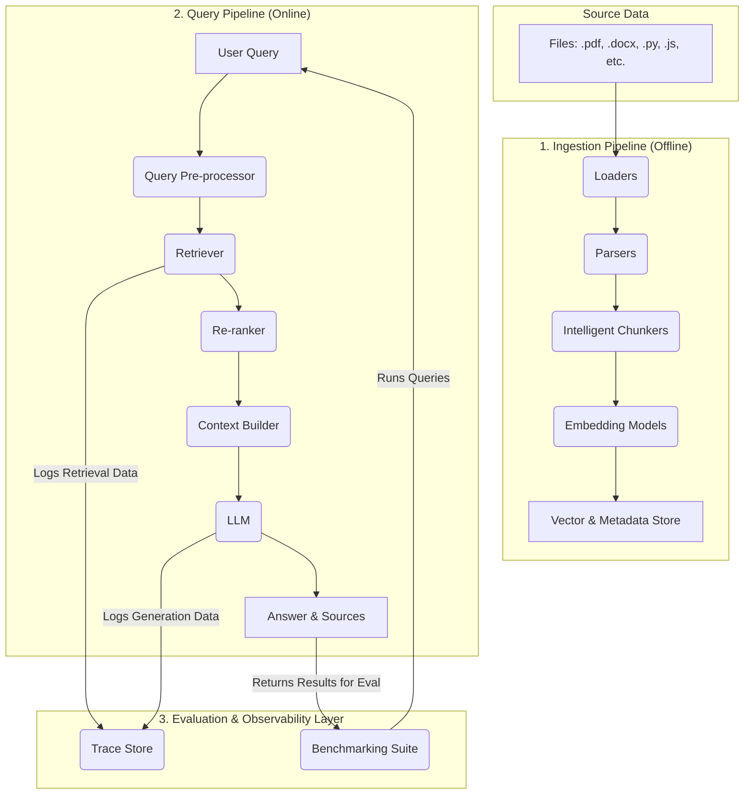

Of course. Here is the entire blueprint in a single Markdown code block.

You can copy this block and paste it directly into an Obsidian note. In Obsidian's Live Preview or Reading mode, the `- [ ]` syntax will render as interactive checkboxes. When you check an item, Obsidian will automatically apply a strikethrough to the text.

# Blueprint: The Rag Machine

## 1. Vision & Mission

- [ ] **Vision:** Become the definitive open-source framework for building production-ready, reliable, and observable Retrieval-Augmented Generation systems.
- [ ] **Mission:** Empower developers to build, debug, evaluate, and deploy RAG systems they can trust, moving beyond "it works on my machine" to "it performs reliably in production."

## 2. Core Architectural Principles

- [ ] **Local-First & Private:** All core operations run locally by default.
- [ ] **Modular & Pluggable:** Every pipeline stage is an interface for easy component swapping.
- [ ] **Observable & Explainable:** The system is a white box; every query's lifecycle is traceable.
- [ ] **Evaluation-Driven:** Built-in tools for benchmarking and quality assurance are core to the framework.
- [ ] **Structure-Aware:** The system natively understands the structure of source material (code functions, document tables, etc.).

## 3. High-Level System Architecture

## 4. Component Implementation Checklist

### Phase 1: Ingestion Pipeline

- [ ] **Loaders**
    - [ ] Generic file loader (`.pdf`, `.docx`, `.md`).
    - [ ] Git repository loader (handles `.gitignore`).
- [ ] **Parsers (Pluggable Interface)**
    - [ ] **Document Parser:** Integrate `Docling` as the primary engine.
    - [ ] **Code Parser:** Integrate `Tree-sitter` for major languages (Python, JS, etc.).
    - [ ] **Fallback Parser:** Simple text/markdown parser.
- [ ] **Intelligent Chunkers**
    - [ ] **Layout-Aware Chunker:** Use `Docling` output for contextual document chunking.
    - [ ] **AST-Aware Chunker:** Use `Tree-sitter` output for logical code chunking (functions, classes).
    - [ ] **Recursive Character Chunker:** As a default strategy.
- [ ] **Embedding Models (Pluggable Interface)**
    - [ ] Support for local models (e.g., via Hugging Face `sentence-transformers`).
    - [ ] Support for API-based models (e.g., OpenAI, Voyage AI).
- [ ] **Vector & Metadata Store (Pluggable Interface)**
    - [ ] **Default Store:** Integrate a local DB like `ChromaDB` or `LanceDB`.
    - [ ] **Metadata Handling:** Ensure rich metadata (source, page, function name) is stored alongside vectors.

### Phase 2: Query Pipeline

- [ ] **Query Pre-processor**
    - [ ] Implement Query Expansion techniques.
- [ ] **Retriever**
    - [ ] Implement Hybrid Search (Dense + Sparse vectors).
- [ ] **Re-ranker**
    - [ ] Implement a post-retrieval re-ranking stage (e.g., using a Cross-Encoder model).
- [ ] **Context Builder & Session Manager**
    - [ ] Build final prompt with retrieved context.
    - [ ] Implement Smart Session Cache for conversational context.
    - [ ] Implement topic drift detection.
- [ ] **LLM (Pluggable Interface)**
    - [ ] Support for local LLMs (e.g., via `Ollama`).
    - [ ] Support for commercial APIs (e.g., OpenAI, Anthropic).

### Phase 3: Evaluation & Observability Layer

- [ ] **Trace Store**
    - [ ] Log the full lifecycle of each query (query, chunks, scores, prompt, response, latency).
    - [ ] Assign a unique `trace_id` to each query.
- [ ] **Benchmarking Suite**
    - [ ] Create a tool to run a "golden dataset" (questions & expected answers).
    - [ ] Implement key RAG metric calculations:
        - [ ] **Retrieval:** Context Precision, Context Recall.
        - [ ] **Generation:** Faithfulness, Answer Relevance.

## 5. API Design Sketch

- [ ] Implement `RagMachine` class.
- [ ] Implement `__init__(self, config)` for configuration.
- [ ] Implement `add(self, source)` for data ingestion.
- [ ] Implement `query(self, text, session_id)` for asking questions.
- [ ] Implement `get_trace(self, trace_id)` for debugging.
- [ ] Define `QueryResult` data class (to hold `answer`, `sources`, `trace_id`).

## 6. Development Roadmap

### Milestone 1: Core Engine (MVP)
- [ ] **Goal:** A functional end-to-end pipeline for Markdown and PDFs.
- [ ] **Tasks:**
    - [ ] Ingestion for `.md` and `.pdf` files.
    - [ ] Basic semantic search (no hybrid/re-ranking).
    - [ ] Basic `query` endpoint returning a string answer.
    - [ ] Basic pluggable interfaces for embedders and LLMs.
    - [ ] Default local vector store integration.
- [ ] **Outcome:** A developer can ingest a PDF and ask a question.

### Milestone 2: The Reliable Engine (Beta)
- [ ] **Goal:** Solve the "silent failure" problem with observability and evaluation.
- [ ] **Tasks:**
    - [ ] Implement the Trace Store and `get_trace()` API.
    - [ ] Build the Benchmarking Suite with core metrics.
    - [ ] Implement Hybrid Search and Re-ranking.
    - [ ] Enhance `QueryResult` to include sources and `trace_id`.
- [ ] **Outcome:** A developer can debug *why* they got an answer and *measure* system quality.

### Milestone 3: The Production Engine (V1.0)
- [ ] **Goal:** Broaden capabilities for production use.
- [ ] **Tasks:**
    - [ ] Integrate Code Parsing with `Tree-sitter`.
    - [ ] Implement the Smart Session Cache and topic drift detection.
    - [ ] Finalize robust error handling and configuration.
    - [ ] Create comprehensive documentation, examples, and tutorials.
- [ ] **Outcome:** A comprehensive, trustworthy RAG framework for building real-world applications.

rag machine:

- md indexing
	- md text comes in
	- it is chunked in header wise format
	- it is then converted into index of all headers with chunk ids attached to headers
	- the index is returned for that document.
- answering user query
	- user asks "what happened in chapter 2 to mary?"
	- query="what happened in chapter 2 to mary?"
	- bot has index, it fetches chapter 2
	- it tries to fetch chunks that has name mary, or with tag mary
	- it then ingest as much chunks it can, and then it tries to answer the question. 
- it also needs to gather and organize chunks in a semantic folder, or type of a "page", and also extract the table id, and attach to the exact chunk/s it refers
- IIMPROVE THE AST CHUNKER FOR OTHER LANGUAGES TOO! link: https://github.com/CintraAI/code-chunker

